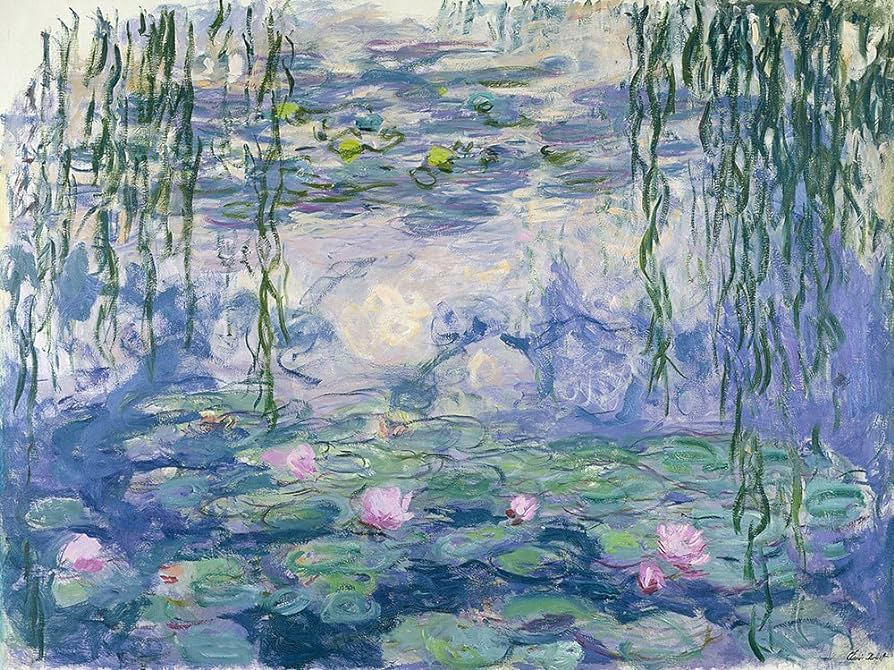

<h1 align="center"> "Hola, mundo!"

</h1>

- 📚 Estudiante de Ingeniería informática en la **Universidad de la Laguna**

- 📜 Apasionado por los videojuegos y las tecnologías

- Sistemas Operativos que uso:      

<h3> Formas de contactarme: </h3>
  

<h3 align="left">Lenguajes y herramientas:</h3>

    <a href="https://www.ruby-lang.org/es/" target="_blank" rel="noreferrer"> 

## Lenguajes más utilizados

  

